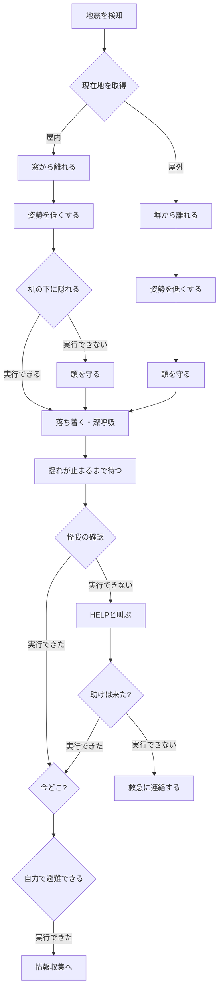

```mermaid
graph TD
  earthquakeStart[地震を検知] --> checkLocationFirst{現在地を取得}

  checkLocationFirst -->|屋内| stayAwayWindow[窓から離れる]
  stayAwayWindow --> dropAction[姿勢を低くする]
  dropAction --> dropUnderDesk{机の下に隠れる}
  dropUnderDesk -->|実行できる| stayCalm
  dropUnderDesk -->|実行できない| coverHead[頭を守る]
  coverHead --> stayCalm[落ち着く・深呼吸]

  checkLocationFirst -->|屋外| stayAwayWall[塀から離れる]
  stayAwayWall --> dropActionOutdoor[姿勢を低くする]
  dropActionOutdoor --> coverHeadOutdoor[頭を守る]
  coverHeadOutdoor --> stayCalm

  stayCalm --> waitShaking[揺れが止まるまで待つ]
  
  waitShaking --> checkInjury{怪我の確認}
  checkInjury -->|実行できた| checkLocation{今どこ?}
  checkInjury -->|実行できない| callHelp[HELPと叫ぶ]
  
  callHelp --> waitRescue{助けは来た?}
  waitRescue -->|実行できた| checkLocation
  waitRescue -->|実行できない| callEmergencyServices[救急に連絡する]
  
  checkLocation --> checkSafe{自力で避難できる}
  checkSafe -->|実行できた| getInfo[情報収集へ]
```
